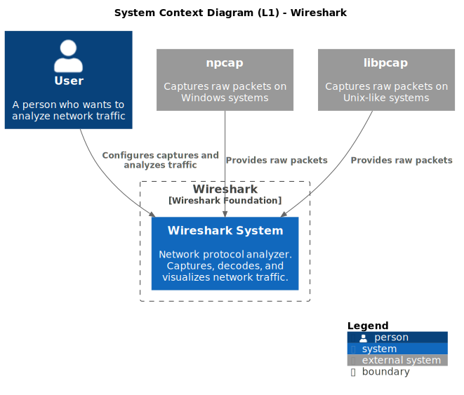
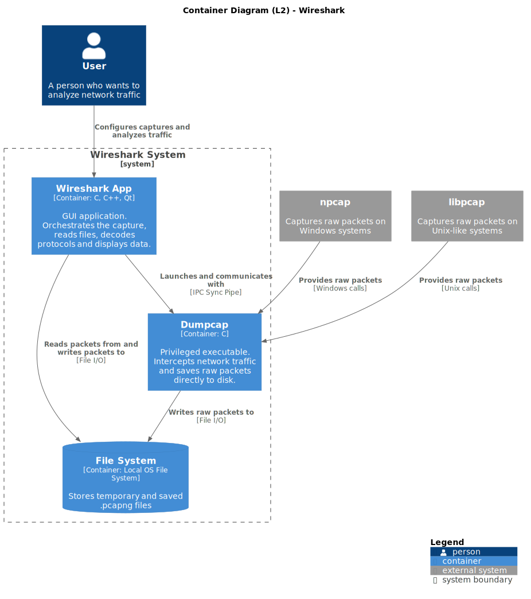
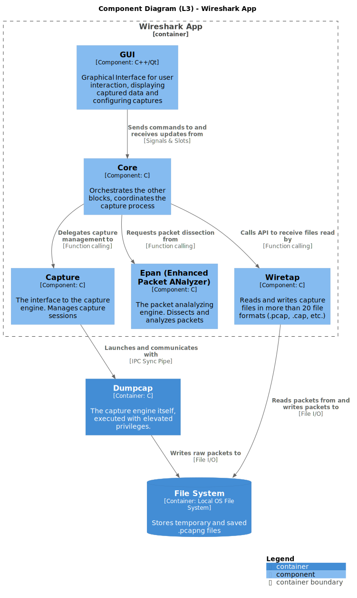
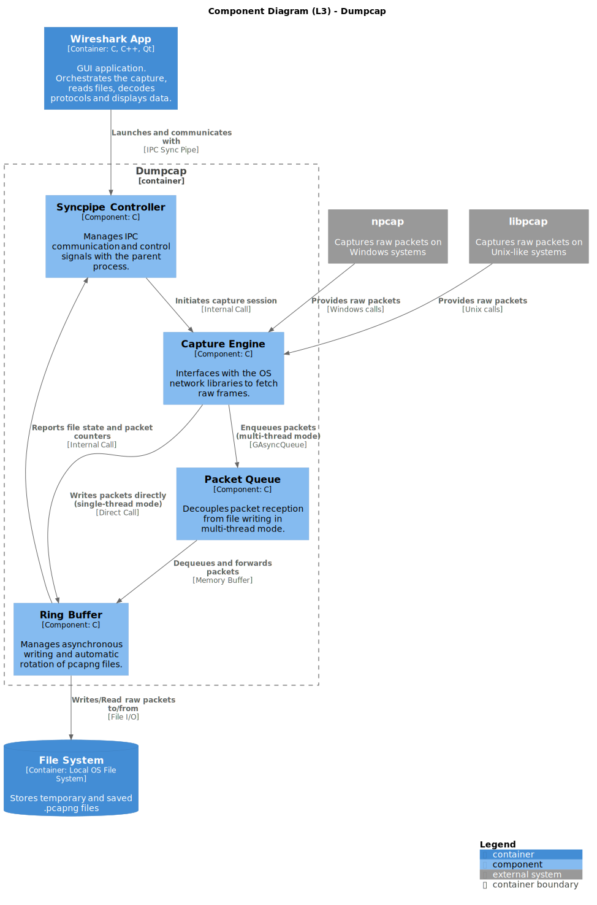

# Wireshark - Software Architecture Report

In this report, we will analyze the architecture of **Wireshark**, providing diagrams for three levels: Context, Container and Components.

For diagramming, we've used **C4-PlantUML**, since it allowed us to quickly make modifications to the diagrams and export them in vector formats. The source code for the diagrams is available in the [architecture-diagrams/code](./architecture-diagrams/code) folder

To further analyze the code, we've used **Sourcetrail**, in order to identify dependencies, and a custom [Python script](../scripts/coupling_analyzer.py) to analyze the coupling of the various modules, in order to better understand their relationships and the overall architectural characteristics.

# Context Diagram (L1)

The System Context diagram is the first level of the C4 model. Its purpose is to place Wireshark within its external environment — showing who uses it and which external systems it depends on, without exposing any internal implementation detail.



## Main System

At the centre of the diagram sits **Wireshark System**, enclosed within the Wireshark Foundation boundary. It is a network protocol analyzer that captures, decodes, and visualizes network traffic. At this level of abstraction the system is a single black box; its internal structure (GUI, Dumpcap, dissectors, etc.) is intentionally hidden.

## Actor

The only human actor is **User**: anyone who needs to inspect network traffic (network analyst, security engineer, or developer). The user drives the system and reads its output.

## External Systems

Two external libraries give Wireshark access to raw network traffic at the OS kernel level:

- **libpcap**: the standard capture library on Unix-like systems (Linux, macOS). It
  exposes APIs for packet capture, BPF filter compilation, and interface management.
- **npcap**: its functional equivalent on Windows, replacing the legacy WinPcap with
  updated driver support and modern Windows APIs.

Both are modelled as external systems because they fall outside the Wireshark Foundation's development boundary: Wireshark consumes their public APIs without owning their source code. Data flows unidirectionally from the library into Wireshark.

---

Delegating raw capture to external libraries is an intentional architectural choice: it abstracts away OS-specific packet capture APIs, making Wireshark portable across platforms without owning low-level driver code.

---

# Container Diagram (L2)

The container diagram represents the second level of the C4 model and zooms into the "Wireshark System" boundary. Here the system stops being a black box and breaks down into its main processes and storage, showing how responsibilities are distributed and how containers communicate with each other.



## Wireshark App

The Wireshark App is the main container, written in C, C++ and Qt. It is the process that the user launches directly and interacts with via GUI. Its responsibilities cover the entire analysis pipeline: orchestrating capture sessions, reading `.pcapng` files produced by Dumpcap, dissecting network protocols and displaying results on screen.

All the user's operational choices (interface, filters, save format) pass through this container. The Wireshark App never directly accesses the network card: it entirely delegates that responsibility to Dumpcap, with which it communicates via IPC Sync Pipe.

## Dumpcap

Dumpcap is a separate executable written in C, designed to do one single thing: intercept network packets and write them to disk in `.pcapng` format. It is the only container in the system that requires elevated privileges (root on Unix, Administrator on Windows), since it must open raw sockets via libpcap or npcap.

Confining privileged code reduces the attack surface: a crash caused by a malicious packet is limited to Dumpcap, leaving the OS and GUI intact. Dumpcap has no graphical interface or analysis logic: it receives instructions from the Wireshark App via the Sync Pipe (interface to capture, BPF filters, output path) and responds with status messages.

## File System

The File System is not a process but a storage, explicitly represented as a container because it plays a precise architectural role: it acts as a shared buffer between Dumpcap and the Wireshark App.

Dumpcap writes packets to a temporary `.pcapng` file as fast as possible, avoiding bottlenecks caused by the GUI rendering speed. The Wireshark App asynchronously reads that same file to decode and display packets as they arrive. The same relationship also covers the writing of permanent capture files saved by the user and the reading of pre-existing `.pcapng` files opened for offline analysis.

---

The container diagram makes two further architectural decisions explicit:

1. Decoupling via IPC: communication between the GUI and Dumpcap occurs via Sync Pipe,
   not via direct function calls. The two processes can crash, be updated or replaced
   independently of each other.

2. File System as shared buffer: writing to disk before displaying decouples the
   capture speed from the rendering speed, making the system robust even under high
   network traffic.

## Relationship with the Clean Architecture Blueprint 

From this overview of the containers, we can see that Wireshark follows the Dependency Rule (dependencies must only point inward): The core logic, inside the **Wireshark App**, does not directly call the specific capture drivers (`libpcap`/`npcap`). Instead, they are called by Dumpcap, which acts as an adapter, keeping the core engine clean of OS-specific privilege management.

---

# Component Diagrams (L3)

The component diagram represents the third level of the C4 model and zooms into the Wireshark App and Dumpcap containers, breaking them down into the components they are made of.

The File System has not been analyzed, since it doesn't include any relevant code and outside of the project scope.

## 1. Wireshark App



In this section we are analyzing the main components that compose the Wireshark Container.
Since the Wireshark App is written almost entirely in C, a procedural language, we've decided to identify components as described on the C4 website, so as *"a number of C files in a particular directory"*.

Some blocks of code that fall under this definition, such as the various Utils, have not been included since they have been considered not relevant for the core system architecture.

TShark, the command-line version of Wireshark which leverages the same underlying components, has not been included in the analysis. This is because, even though it is present in the repository, in all of the official documentation it is considered as a separate project, and not part of the main Wireshark distribution. For this reason, it has been considered outside of the analysis scope.

Alongside each component, the corresponding directory will be indicated.

### Core
```console
Location: /
```

Written in C, this component acts as the central brain or orchestrator of the application. It contains the primary business logic, coordinating data flow and state changes between the user interface, the capture subsystem, and the dissection engine.

### GUI
```console
Location: /ui
```

The only C++ component, utilizes the Qt framework to maintain cross-platform visual consistency and handles asynchronous UI updates without blocking the main rendering thread.

It can be expanded with plugins, which can add new toolbars and submenus.

### Capture
```console
Location: /capture
```

A C-based abstraction layer acting as the direct interface to the underlying capture engine. It manages the lifecycle of capture sessions, including configuration, initialization, state tracking, and session termination.

The packet capture operation requires elevated system privileges (root or administrator access) to put network interfaces into promiscuous mode. To minimize security vulnerabilities, Wireshark runs with standard user privileges, while only Dumpcap runs with elevated privileges.

The Capture component launches and establishes a connection with Dumpcap via an Inter-Process Communication (IPC) Sync Pipe.

Once a block of packets is successfully committed to disk, Dumpcap signals the Capture component via the IPC pipe, which subsequently alerts the Core.

### Epan (Enhanced Packet ANalyzer)

```console
Location: /epan
```

The packet analyzing engine, implemented in C. Epan is the most complex component within Wireshark. It is responsible for packet dissection, dependency tracking between protocols, applying display filters, and executing plugins/macros.
It provides the following APIs:
  - **Dissectors**: software modules that decode a specific network protocol.
  - **Protocol Tree**: hierarchical structure containing the dissected information for an individual packet.
  - **Display Filters**: engine that shows packets with certain characteristics.

Moreover, Epan supports the implementation of custom dissectors as separate modules, thanks to native plugin support.

This characteristic is very important from an architecture perspective, since it allows for adding support for new protocols without touching any of the existing logic.

### Wiretap

```console
Location: /wiretap
```

Wiretap is specialized C library purpose-built for file format abstraction.

It acts as a translation layer capable of reading and writing packet data across more than 20 distinct capture file formats (such as .pcap, .pcapng, and .cap).

Also, just like Epan, it features native plugins support, allowing the reading of new file formats.

### Complete flow

**Initialization**

The process begins when a user initiates a capture through the GUI. Because capturing raw network packets requires elevated system privileges that the main GUI process lacks, the Core delegates this task to the Capture component, which launches Dumpcap. By keeping Dumpcap isolated, the rest of the Wireshark application can safely run with standard user privileges.

**The Capture Loop**

Once active, Dumpcap interfaces directly with the network card, grabbing raw packets off the wire at lightning speed. To prevent memory bloat during massive data streams, Wireshark adopts a "write-first, read-later" strategy. Dumpcap continuously writes these raw packets directly into a temporary file on the local hard disk.

The coordination from this point forward is synchronized: as soon as Dumpcap finishes writing a block of packets to the disk, it notifies the Capture component via an IPC Sync Pipe.

The Capture component immediately passes this signal up to the application's central brain, the Core, letting it know that fresh data is ready to be processed.

**Reading and Dissection**

Upon receiving the notification from the Capture component, the Core calls upon Wiretap. Wiretap opens the temporary file on the hard disk, reads the newly written raw packet blocks, and abstracts away the underlying file format complexities.

Once Wiretap reads the data, the Core passes the raw bytes to Epan, which delegates them to a chain of specialized protocol dissectors, and finally routes the structured, human-readable results back up to the GUI for the user to see.

### SOLID Principles Violations

A violation of the SOLID principles in Wireshark occurs in relation to the **Interface Segregation Principle** (ISP).
Since C is a procedural language lacking native interface support, header files act as the interfaces. Under this definition, major headers like the one for Epan (`epan.h`) heavily violate ISP: they expose a massive array of functions, forcing individual modules to depend on an API surface far larger than what they actually utilize.

## 2. Dumpcap



In this section we are analyzing the main components that compose Dumpcap.

Since Dumpcap is a single 6000-lines C file, we've decided to identify components as *"a logical grouping of related functions"*.

### Sync Pipe Controller

The Sync Pipe Controller manages all communications with the parent process (Wireshark App) via the Sync Pipe. It propagates the start of the capture session into Dumpcap and, in the opposite direction, receives updates on the active file and packet counter from the Ring Buffer to forward them to the Wireshark App. This mechanism allows the GUI to know in real time which file to read and how many packets have been captured.

### Capture Engine

The Capture Engine is the operational core of Dumpcap. It interfaces with libpcap/npcap to receive raw packets from the network. During initialization it opens the capture handles and applies the BPF filter directly on the handle via `pcap_setfilter()`: filtering occurs at the kernel level, so the Capture Engine already receives only the packets matching the user's filter. It then enters the listening loop and routes received packets to the downstream components.

### Packet Queue

The Packet Queue is an asynchronous buffer (GAsyncQueue) that decouples packet reception from disk writing in multi-thread mode.
The Capture Engine enqueues packets without waiting for the write to complete; a dedicated thread dequeues and delivers them to the Ring Buffer.
This decoupling prevents any slowness in writing from affecting reception speed, reducing the risk of packet drops under high load.

### Ring Buffer

The Ring Buffer saves packets to disk in `.pcapng` format and manages automatic file rotation based on configurable thresholds (size, duration, packet count).
It receives packets from the Packet Queue (multi-thread) or directly from the Capture Engine (single-thread).
Once written, it notifies the Sync Pipe Controller with the current file state and updated counters, closing the feedback loop toward Wireshark.

---

1. The Capture Engine integrates both privilege management and BPF filter setup directly
   during initialization, rather than delegating them to separate components.

2. The pipeline supports two write paths — multi-thread via the Packet Queue and
   single-thread via direct write — making it adaptable to varying network load without
   requiring changes to the other components.

3. Status information flows upward: the Ring Buffer notifies the Sync Pipe Controller
   once packets are written, reflecting the actual direction of data in the pipeline.

# Architectural characteristics

Wireshark is a network protocol analyzer that relies heavily on a robust, highly modular software architecture. Its system design prioritizes key architectural characteristics: **extensibility**, **maintainability**, and **portability**.

---

### Extensibility

Network environments continuously evolve, requiring Wireshark to support thousands of active protocols. To manage this scale, Wireshark relies heavily on a core architectural quality: **extensibility**.

#### Architectural Support

This characteristic is achieved through plugin support for its analysis engine (`epan`): it dictates *when* packets are processed, but leaves the *how* to individual **dissectors** (protocol plugins).

#### Coupling & Cohesion Analysis

* **Low Coupling:** The individual dissectors can be modified without ever touching the packet analyzer logic, since it only manages the analysis, without including parsing logic.
* **High Cohesion:** Each dissector has very high cohesion, as it has exactly one responsibility: parsing a specific layer of a single protocol format.

---

### Maintainability (Separation of Concerns)

Wireshark has three main functions: it handles packet capture, packet analysis and frontend visualization.

#### Architectural Support

The architecture structurally enforces a strict **Separation of Concerns** by splitting the application into distinct layers:

* **Capture Layer:** A lightweight, isolated process dedicated solely to packet capture.
* **Analysis Layer:** The engine that handles packet dissection and protocol state machines.
* **UI Layer:** The graphical interface that presents data to users.

#### Coupling & Cohesion Analysis

* **Low Coupling between layers:** The layers are completely separated thanks to the use of IPC Pipe and Async I/O. If the GUI freezes or crashes under a heavy rendering load, packet capturing remains entirely uninterrupted.
* **High Layer Cohesion:** Each Layer has a well defined purpose, allowing developers to completely overhaul or replace the logic of a certain layer without ever touching the others (as has already happened with the transition of the GUI framework from GTK to Qt).

---

### Portability

Wireshark must reliably run across a diverse range of environments, from Linux servers to Windows and macOS desktops.

#### Architectural Support

Portability is built into the architecture by isolating OS-specific operations behind clean hardware-abstraction libraries. Instead of implementing direct network card packet captures natively, Wireshark relies on the **`libpcap`/`npcap**` ecosystem.

#### Coupling & Cohesion Analysis

* **Low Logical Coupling:** By wrapping platform-specific dependencies into a distinct abstraction layer, the core dissection engine is logically decoupled from host operating system calls.
* **High Cohesion:** The capture backend focuses strictly on bridging network hardware buffers to cross-platform standard file formats (`pcapng`). This clean separation ensures that adapting Wireshark to new operating systems rarely requires modifications to the core protocol dissection libraries.
